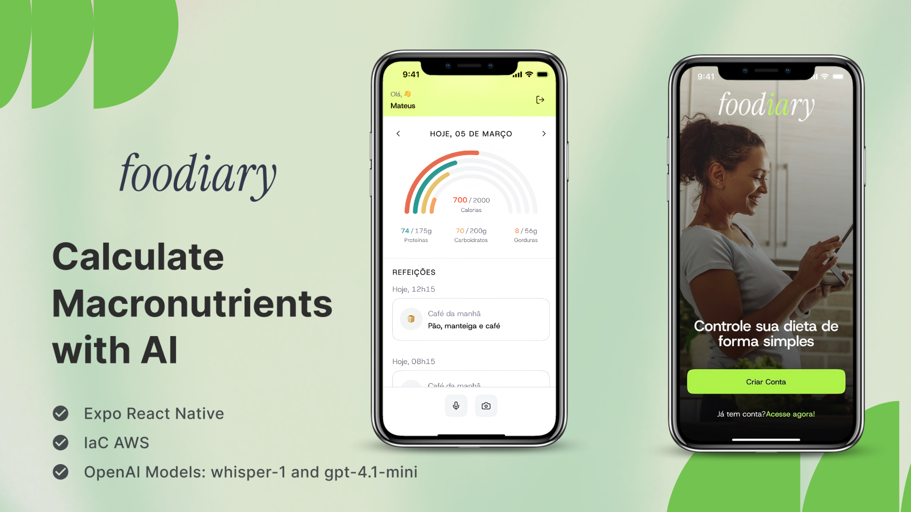

<div align="center">
  
  
  # 🍽️ Foodiary API
  
  <p>
    <a href="#english">🇺🇸 English</a> •
    <a href="#portuguese">🇧🇷 Português</a>
  </p>
  
  [](https://aws.amazon.com/)
  [](https://www.typescriptlang.org/)
  [](https://nodejs.org/)
  [](https://openai.com/)
</div>

---

## 📱 Related Projects

- **📱 Mobile App**: [Foodiary Mobile App](https://github.com/your-username/foodiary-mobile) - React Native application
- **🌐 Web App**: [Foodiary Web App](https://github.com/your-username/foodiary-web) - React web application

---

<div id="english"></div>

# 🇺🇸 English

## 📋 About the Project

**Foodiary API** is a robust and scalable serverless solution for intelligent meal tracking, built with modern architecture and cutting-edge technologies. The API leverages artificial intelligence (OpenAI GPT-4 and Whisper) to automatically analyze meal photos and audio recordings, extracting detailed nutritional information and providing personalized insights based on user goals.

### 🎯 Key Features

- **🔐 JWT Authentication** - Secure authentication system with tokens
- **📸 Image Analysis** - Intelligent processing of meal photos via GPT-4 Vision
- **🎤 Audio Transcription** - Audio-to-text conversion using Whisper
- **🧮 Goal Calculation** - Custom algorithms for macronutrient calculation
- **☁️ Serverless Architecture** - AWS deployment with Lambda, S3, and SQS
- **🔄 Asynchronous Processing** - Queues for meal processing
- **📊 Nutritional Tracking** - Monitoring calories, proteins, carbohydrates, and fats

## 🏗️ Architecture

### Technology Stack

- **Runtime**: Node.js 22.x (ARM64)
- **Framework**: Serverless Framework
- **Cloud Provider**: AWS
- **Database**: PostgreSQL (Neon)
- **ORM**: Drizzle ORM
- **AI Services**: OpenAI (GPT-4, Whisper)
- **Storage**: AWS S3
- **Message Queue**: AWS SQS
- **Authentication**: JWT with bcryptjs

### AWS Infrastructure

```text
┌─────────────────┐    ┌─────────────────┐    ┌─────────────────┐
│   API Gateway   │    │   Lambda        │    │   PostgreSQL    │
│   (HTTP API)    │◄──►│   Functions     │◄──►│   (Neon)        │
└─────────────────┘    └─────────────────┘    └─────────────────┘
                                │
                                ▼
                       ┌─────────────────┐
                       │   S3 Bucket     │
                       │   (Uploads)     │
                       └─────────────────┘
                                │
                                ▼
                       ┌─────────────────┐
                       │   SQS Queue     │
                       │   (Processing)  │
                       └─────────────────┘
```

## 🚀 API Endpoints

### Authentication

- `POST /signup` - User registration with automatic goal calculation
- `POST /signin` - Login and JWT token generation
- `GET /me` - Authenticated user information

### Meals

- `POST /meals` - Create new meal (file upload)
- `GET /meals` - List user meals
- `GET /meals/{id}` - Get specific meal details

## 🔧 Setup and Deployment

### Prerequisites

- Node.js 22.x
- AWS CLI configured
- Serverless Framework
- OpenAI account

### Environment Variables

```bash
DATABASE_URL=postgresql://...
JWT_SECRET=your-secret-key
OPENAI_API_KEY=your-openai-key
```

### Installation

```bash
# Clone the repository
git clone <repository-url>
cd foodiary-api

# Install dependencies
npm install

# Configure environment variables
cp .env.example .env

# Deploy to AWS
npm run deploy
```

### Local Development

```bash
# Start development environment
npm run dev
```

## 📊 Data Model

### Users

- Personal information (name, email, gender, birth date)
- Physical data (height, weight, activity level)
- Automatically calculated nutritional goals

### Meals

- Processing status (uploading, processing, success, failed)
- Input type (audio or image)
- AI-extracted nutritional data
- Complete food history

## 🤖 AI Integration

### Image Analysis (GPT-4 Vision)

- Automatic food identification
- Quantity and portion estimation
- Macronutrient calculation per food item
- Intelligent classification by meal time

### Audio Transcription (Whisper)

- Audio-to-text conversion in Portuguese
- Meal description processing
- Nutritional information extraction from text

## 🔒 Security

- **JWT Authentication** with secure tokens
- **Password hashing** with bcryptjs
- **Data validation** with Zod
- **CORS configured** for security
- **IAM roles** specific to each AWS service

## 📈 Scalability

- **Serverless Architecture** - Auto-scaling
- **Asynchronous Processing** - SQS queues for high availability
- **Dead Letter Queues** - Robust error handling
- **Batch Processing** - Batch processing for efficiency

## 🧪 Code Quality

- **TypeScript** for type safety
- **Drizzle ORM** for type-safe queries
- **Zod** for schema validation
- **Modular structure** with controllers and services
- **Centralized error handling**

## 📝 Usage Examples

### User Registration

```typescript
POST /signup
{
  "account": {
    "name": "John Silva",
    "email": "john@email.com",
    "password": "password123"
  },
  "goal": "lose_weight",
  "gender": "male",
  "birthDate": "1990-01-01",
  "height": 175,
  "weight": 80,
  "activityLevel": 3
}
```

### Meal Creation

```typescript
POST /meals
{
  "fileType": "image/jpeg"
}
// Returns: { mealId, uploadUrl }
```

## 🤝 Contributing

1. Fork the project
2. Create a feature branch (`git checkout -b feature/AmazingFeature`)
3. Commit your changes (`git commit -m 'Add some AmazingFeature'`)
4. Push to the branch (`git push origin feature/AmazingFeature`)
5. Open a Pull Request

## 📄 License

This project is licensed under the ISC License. See the `LICENSE` file for more details.

## 👨‍💻 Developer

Developed with ❤️ to facilitate intelligent nutritional tracking.

---

<div align="center">
  <p>Made with TypeScript, AWS and lots of ☕</p>
</div>

---

<div id="portuguese"></div>

# 🇧🇷 Português

## 📋 Sobre o Projeto

O **Foodiary API** é uma solução serverless robusta e escalável para rastreamento inteligente de refeições, desenvolvida com arquitetura moderna e tecnologias de ponta. A API utiliza inteligência artificial (OpenAI GPT-4 e Whisper) para analisar automaticamente fotos e áudios de refeições, extraindo informações nutricionais detalhadas e fornecendo insights personalizados baseados nos objetivos do usuário.

### 🎯 Principais Funcionalidades

- **🔐 Autenticação JWT** - Sistema seguro de autenticação com tokens
- **📸 Análise de Imagens** - Processamento inteligente de fotos de refeições via GPT-4 Vision
- **🎤 Transcrição de Áudio** - Conversão de áudios para texto usando Whisper
- **🧮 Cálculo de Metas** - Algoritmos personalizados para cálculo de macronutrientes
- **☁️ Arquitetura Serverless** - Deploy na AWS com Lambda, S3 e SQS
- **🔄 Processamento Assíncrono** - Filas para processamento de refeições
- **📊 Rastreamento Nutricional** - Monitoramento de calorias, proteínas, carboidratos e gorduras

## 🏗️ Arquitetura (Português)

### Stack Tecnológica

- **Runtime**: Node.js 22.x (ARM64)
- **Framework**: Serverless Framework
- **Cloud Provider**: AWS
- **Database**: PostgreSQL (Neon)
- **ORM**: Drizzle ORM
- **AI Services**: OpenAI (GPT-4, Whisper)
- **Storage**: AWS S3
- **Message Queue**: AWS SQS
- **Authentication**: JWT com bcryptjs

### Infraestrutura AWS

```text
┌─────────────────┐    ┌─────────────────┐    ┌─────────────────┐
│   API Gateway   │    │   Lambda        │    │   PostgreSQL    │
│   (HTTP API)    │◄──►│   Functions     │◄──►│   (Neon)        │
└─────────────────┘    └─────────────────┘    └─────────────────┘
                                │
                                ▼
                       ┌─────────────────┐
                       │   S3 Bucket     │
                       │   (Uploads)     │
                       └─────────────────┘
                                │
                                ▼
                       ┌─────────────────┐
                       │   SQS Queue     │
                       │   (Processing)  │
                       └─────────────────┘
```

## 🚀 Endpoints da API (Português)

### Autenticação

- `POST /signup` - Registro de usuário com cálculo automático de metas
- `POST /signin` - Login e geração de token JWT
- `GET /me` - Informações do usuário autenticado

### Refeições

- `POST /meals` - Criar nova refeição (upload de arquivo)
- `GET /meals` - Listar refeições do usuário
- `GET /meals/{id}` - Obter detalhes de uma refeição específica

## 🔧 Configuração e Deploy

### Pré-requisitos

- Node.js 22.x
- AWS CLI configurado
- Serverless Framework
- Conta OpenAI

### Variáveis de Ambiente

```bash
DATABASE_URL=postgresql://...
JWT_SECRET=your-secret-key
OPENAI_API_KEY=your-openai-key
```

### Instalação

```bash
# Clone o repositório
git clone <repository-url>
cd foodiary-api

# Instale as dependências
npm install

# Configure as variáveis de ambiente
cp .env.example .env

# Deploy para AWS
npm run deploy
```

### Desenvolvimento Local

```bash
# Inicie o ambiente de desenvolvimento
npm run dev
```

## 📊 Modelo de Dados

### Usuários

- Informações pessoais (nome, email, gênero, data de nascimento)
- Dados físicos (altura, peso, nível de atividade)
- Metas nutricionais calculadas automaticamente

### Refeições

- Status de processamento (uploading, processing, success, failed)
- Tipo de entrada (áudio ou imagem)
- Dados nutricionais extraídos pela IA
- Histórico completo de alimentos

## 🤖 Integração com IA

### Análise de Imagens (GPT-4 Vision)

- Identificação automática de alimentos
- Estimativa de quantidades e porções
- Cálculo de macronutrientes por alimento
- Classificação inteligente por horário da refeição

### Transcrição de Áudio (Whisper)

- Conversão de áudio para texto em português
- Processamento de descrições de refeições
- Extração de informações nutricionais do texto

## 🔒 Segurança

- **Autenticação JWT** com tokens seguros
- **Hash de senhas** com bcryptjs
- **Validação de dados** com Zod
- **CORS configurado** para segurança
- **IAM roles** específicas para cada serviço AWS

## 📈 Escalabilidade

- **Arquitetura Serverless** - Escala automaticamente
- **Processamento Assíncrono** - Filas SQS para alta disponibilidade
- **Dead Letter Queues** - Tratamento de erros robusto
- **Batch Processing** - Processamento em lotes para eficiência

## 🧪 Qualidade de Código

- **TypeScript** para type safety
- **Drizzle ORM** para queries type-safe
- **Zod** para validação de schemas
- **Estrutura modular** com controllers e services
- **Error handling** centralizado

## 📝 Exemplo de Uso

### Registro de Usuário

```typescript
POST /signup
{
  "account": {
    "name": "João Silva",
    "email": "joao@email.com",
    "password": "senha123"
  },
  "goal": "lose_weight",
  "gender": "male",
  "birthDate": "1990-01-01",
  "height": 175,
  "weight": 80,
  "activityLevel": 3
}
```

### Criação de Refeição

```typescript
POST /meals
{
  "fileType": "image/jpeg"
}
// Retorna: { mealId, uploadUrl }
```

## 🤝 Contribuição

1. Fork o projeto
2. Crie uma branch para sua feature (`git checkout -b feature/AmazingFeature`)
3. Commit suas mudanças (`git commit -m 'Add some AmazingFeature'`)
4. Push para a branch (`git push origin feature/AmazingFeature`)
5. Abra um Pull Request

## 📄 Licença

Este projeto está sob a licença ISC. Veja o arquivo `LICENSE` para mais detalhes.

## 👨‍💻 Desenvolvedor

Desenvolvido com ❤️ para facilitar o rastreamento nutricional inteligente.

---

<div align="center">
  <p>Feito com TypeScript, AWS e muito ☕</p>
</div>
